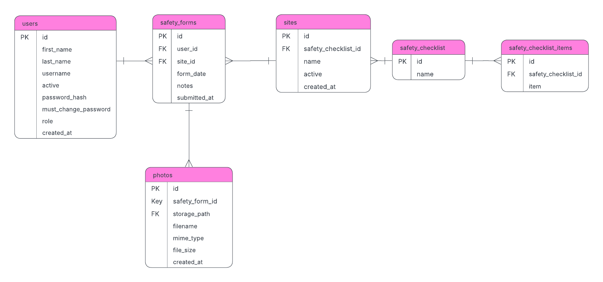

# Ron Anderson & Sons Safety Forms

A web application for managing and submitting workplace safety forms.

Framers can complete safety forms for a selected site and date, while administrators can manage users, manage sites, and review submitted forms.

## Tech Stack

**Frontend**
- React 19 with Vite
- React Router
- Recharts and Lucide React
- JavaScript
- HTML/CSS

**Backend**
- Java 21
- Spring Boot 4
- Spring Data JPA, Spring Session JDBC, and Spring Security Crypto
- Flyway database migrations

**Data and storage**
- PostgreSQL
- Supabase Storage for submitted photos

## Project Structure

```text
/frontend   React frontend
/backend    Spring Boot backend
/docs       Entity relationship diagram
```

## Setup

### Prerequisites

Make sure the following are installed:

- Node.js and npm
- Java 21 / JDK 21
- PostgreSQL
- A Supabase project with a private photo-storage bucket

Create an empty PostgreSQL database named `ras_safety_form`. In the project root,
create a git-ignored `.env` file:

```properties
DB_URL=jdbc:postgresql://localhost:5432/ras_safety_form
DB_USERNAME=postgres
DB_PASSWORD=your_database_password
SUPABASE_URL=https://your-project.supabase.co
SUPABASE_SECRET_KEY=your_service_role_key
SUPABASE_BUCKET=your_private_bucket
```

### Backend

Navigate to the backend folder:

```bash
cd backend
```

Start the application. Flyway applies the database migrations automatically.

```bash
./mvnw spring-boot:run
```

On Windows, use `mvnw.cmd spring-boot:run`. After the first migration, run the
seed file from the project root:

```bash
psql -U postgres -d ras_safety_form -f backend/sql/seed.sql
```

The backend runs at `http://localhost:8080`.

### Frontend

Navigate to the frontend folder:

```bash
cd frontend
```

Install dependencies:

```bash
npm ci
```

Start the development server:

```bash
npm run dev
```

The frontend runs at `http://localhost:5173` and proxies `/api` to the backend.

## Demo Login Credentials

### Admin

- **Username:** `admin`
- **Password:** `Admin123!`

### Framer

- **Username:** `framer`
- **Password:** `Framer123!`

## Database / ERD

The Entity Relationship Diagram for the application is included in this repository.



## Assumptions

- There are two user roles: Admin and Framer.
- User accounts are created by administrators. New users are required to change their password on first login.
- Administrators can deactivate user accounts rather than delete them so historical safety-form data remains associated with the original user.
- Admin cannot edit existing user accounts beyond deactivating them.
- Framers select a site when completing a safety form rather than being assigned to sites in advance.
- Framers may submit multiple safety forms for the same site and date. This supports cases where a worker changes sites during the day or leaves and later returns to the same site.
- All checklist items must be checked before a safety form can be submitted, as they are treated as mandatory site-safety requirements.
- Once submitted, a safety form cannot be edited by either the Framer or an Admin.
- Administrators can create, edit, and deactivate sites and their associated safety checklists so site changes do not require direct database modifications.
- A password-reset flow was not implemented for this assessment, so users who forget their password cannot recover access through the application.
- Authentication and session-management tables created by Spring are treated as infrastructure and are not included in the application ERD.

## Deployment

The backend serves the REST API under `/api` and the built frontend from the same
origin, with `index.html` as the fallback for client-side routes.

```bash
cd frontend && npm ci && npm run build
cd ../backend && ./mvnw package        # copies ../frontend/dist into the jar
java -jar target/safety-form-0.0.1-SNAPSHOT.jar
```

Run with `SPRING_PROFILES_ACTIVE=prod` behind HTTPS (secure session cookies and HSTS).
Point the platform health check at `GET /api/health`: it returns `200` only when both
the database and the photo-storage bucket are reachable, otherwise `503`. Any reverse
proxy in front of the app must allow request bodies of at least 60 MB (five 10 MB
photos plus overhead). Never commit credentials; keep them in `.env` (git-ignored) or
the host's secret store. See `.env.example`.

| Variable | Required | Purpose |
| --- | --- | --- |
| `DB_URL`, `DB_USERNAME`, `DB_PASSWORD` | yes | Database connection (there is no default password) |
| `SUPABASE_URL`, `SUPABASE_SECRET_KEY`, `SUPABASE_BUCKET` | yes | Photo storage |
| `SPRING_PROFILES_ACTIVE` | production | `prod` enables secure cookies and HSTS |
| `LEGACY_DATA_TIMEZONE` | first migration of an existing database | IANA zone the old naive timestamps were written in (default `UTC`) |
| `PORT` | optional | HTTP port (default 8080) |
| `FORWARD_HEADERS_STRATEGY` | optional | `native` (default) trusts the platform proxy's `X-Forwarded-*` headers; `none` when not behind a proxy |
| `CORS_ALLOWED_ORIGINS` | optional | Comma-separated origins, only if the frontend is hosted on another origin |
| `SESSION_COOKIE_SECURE`, `SESSION_COOKIE_SAME_SITE`, `HSTS_ENABLED` | optional | Override cookie and HSTS defaults (`None` requires secure) |
| `LOGIN_RATE_LIMIT_MAX_ATTEMPTS`, `LOGIN_RATE_LIMIT_WINDOW` | optional | Failed-login limit per client and username (defaults `5` / `15m`) |

### Migrating an existing database

Flyway baselines a database created from the old `sql/schema.sql` at `V1` and applies
`V2`, which converts every timestamp column to `TIMESTAMPTZ`, adds
`safety_forms.status` and adds indexes. Existing timestamps were stored as naive local
times, so set `LEGACY_DATA_TIMEZONE` to the zone the old server ran in before the first
start, and back up the database first. New schema changes go in new
`backend/src/main/resources/db/migration/V<n>__description.sql` files; never edit an
applied migration. `backend/sql/schema.sql` mirrors the final schema for reference only.
